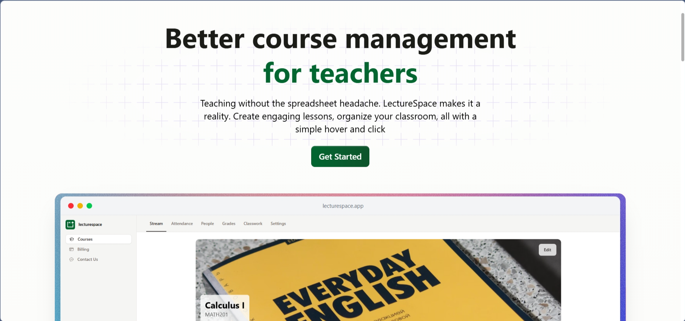
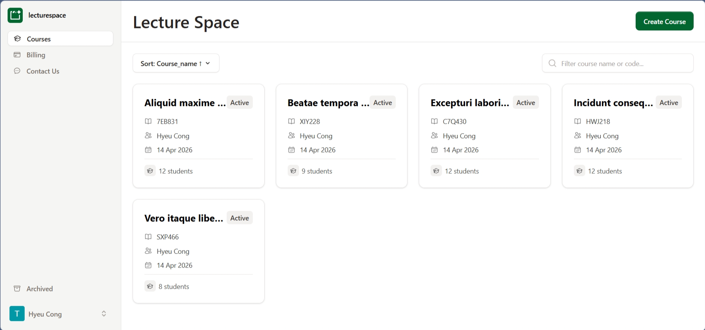
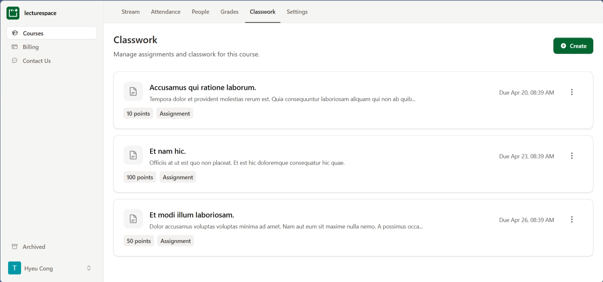
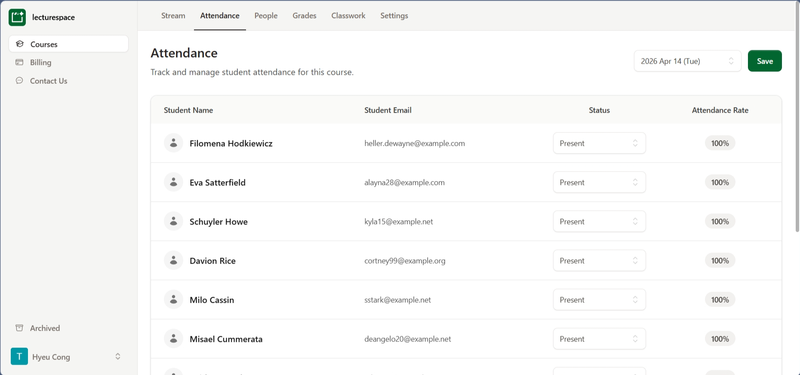

# Course Management System

A professional, modern Course Management System built with Laravel and Livewire. This application allows educators to manage courses, students, assignments, and attendance with ease.

## Screenshots

[](media/landing_page.png)

| Courses | Classwork | Attendance |
| :---: | :---: | :---: |
| [](media/courses.png) | [](media/classwork.png) | [](media/attendance.png) |

---

## Features

- **Dashboard**: Overview of active courses with card-based navigation.
- **Course Feed**: Real-time updates and announcements within courses.
- **Classwork Management**: Create, track, and manage student assignments and points.
- **Student Enrollment**: Efficiently manage student lists and course registrations.
- **Attendance Tracking**: Keep track of student presence for every course session.
- **Gradebook**: Centralized location for managing and viewing student grades.
- **Modern UI**: Built with a focus on usability and modern aesthetics.

## Tech Stack

- **Framework**: Laravel 11
- **Frontend**: Livewire, Flux UI, Tailwind CSS
- **Database**: SQLite (default) / MySQL supported
- **Authentication**: WorkOS Integration

## Installation

Follow these steps to set up the project locally:

1. **Clone the repository**
   ```bash
   git clone https://github.com/hyeucong/course-managment.git
   cd course-managment
   ```

2. **Install dependencies**
   ```bash
   composer install
   npm install
   npm run build
   ```

3. **Configure Environment**
   ```bash
   cp .env.example .env
   php artisan key:generate
   ```

4. **Database Setup**
   ```bash
   touch database/database.sqlite
   php artisan migrate --seed
   ```

## Demo Data

Populate the project with demo data:
```bash
php artisan db:seed
```
*Tip: Customize admin account details in your .env file using SEED_ADMIN variables to gain full ownership.*
